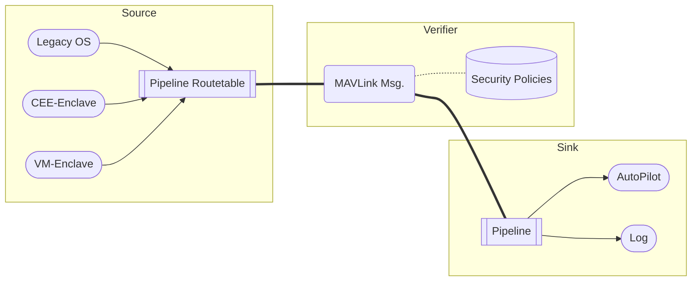
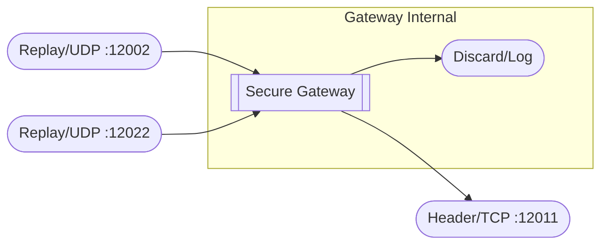

# Secure MAVLink Gateway



## Build

### Prerequisites

* [CMake](https://cmake.org/)
* [Python 3](https://www.python.org/)
* [GCC](https://gcc.gnu.org/)

### Instructions

1. Pull the repositories
```shell
git submodule update --init --recursive
```

2. Create a build directory
```shell
mkdir build
cd build

cmake ..
```

3. Create MAVLink header files:
```shell
make mavlink_headers
```

4. Build the project:
```shell
make secure_gateway
```

## Run

```shell
./secure_gateway
```

## Test

### Case 1 - reject all MEMINFO messages




```shell
# build secure_gateway
# in terminal 1
./secure_gateway

# in terminal 2, connect VMC header
cd test
./mavlink_msg_header.py --header tcp --port 12011

# in terminal 3, connect legacy replay
# note: `-n -1` means replay forever
cd test
./mavlink_msg_replay.py --adapter udp --udp 12002 -n -1

# in terminal 4, connect CEE replay
cd test
./mavlink_msg_replay.py --adapter udp --udp 12022 -n -1
```

